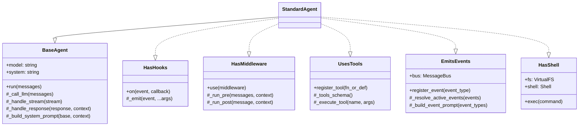
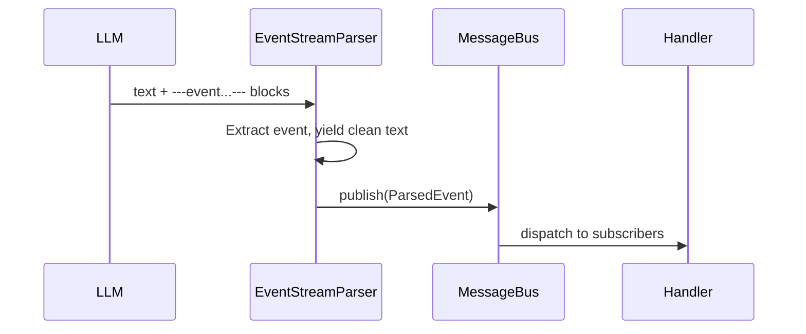
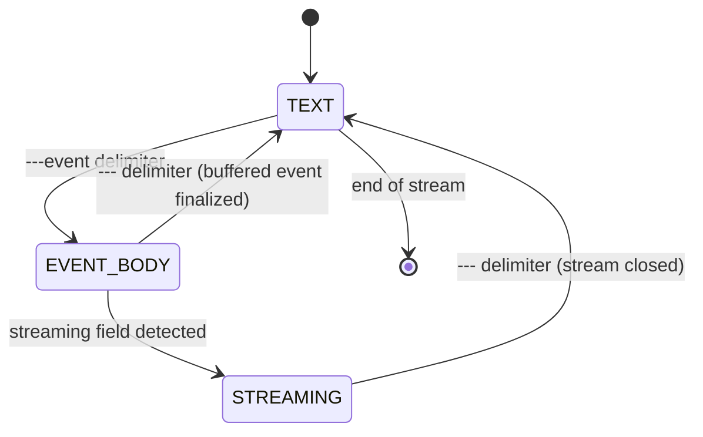
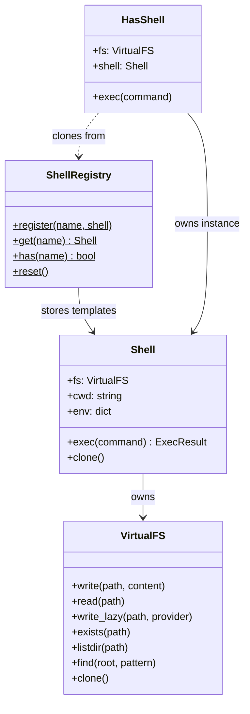

# Component Architecture

This document describes the internal architecture of the harness framework. It covers the composition model, event system, parser internals, and component responsibilities across all three language implementations (Python, TypeScript, PHP).

---

## Trait/Mixin Composition Model

Agents are assembled from independent mixins (or traits, depending on the language). Each mixin encapsulates a single capability -- hooks, middleware, tools, or event emission -- and can be used in isolation or combined freely. `StandardAgent` is the pre-composed class that pulls in every mixin alongside `BaseAgent`, giving you a fully-featured agent out of the box.

Because the mixins are independent, you can also subclass `BaseAgent` directly and mix in only what you need. The only hard dependency is that `EmitsEvents` expects `EventStreamParser` to be wired into the response-handling path.



Solid lines denote inheritance; dashed lines denote mixin/trait implementation.

---

## Event System Flow

The event system lets the LLM emit structured data inline within its natural-language output. The flow works as follows:

1. The LLM produces text that contains YAML event blocks delimited by `---event` / `---` markers.
2. `EventStreamParser` processes the token stream, extracts complete event blocks, and yields the remaining clean text back to the caller.
3. Each extracted event is wrapped in a `ParsedEvent` and published to the `MessageBus`.
4. The `MessageBus` dispatches the event to all matching subscribers (handlers).



This design keeps the LLM's conversational output free of event markup from the caller's perspective, while still allowing structured side-channel data to flow through the system.

---

## Parser State Machine

`EventStreamParser` uses a three-state machine to process the incoming token stream.



### State descriptions

- **TEXT** -- Normal text tokens. Everything in this state is yielded through to the caller as clean output. The parser watches for a `---event` delimiter to transition.

- **EVENT_BODY** -- Accumulating YAML lines between the opening `---event` and closing `---` delimiters. On each line, the parser checks whether a streaming field has been detected; if so, it transitions to the STREAMING state. When the closing delimiter arrives, the buffered YAML is parsed into a `ParsedEvent` and published.

- **STREAMING** -- Streaming content is forwarded to an async iterator whose implementation varies by language: a `Queue` in Python, a channel in TypeScript, and a Generator buffer in PHP. The closing `---` delimiter ends the stream and returns the parser to the TEXT state.

---

## Component Inventory

| Component | Responsibility |
|-----------|---------------|
| **BaseAgent** | Core agent loop: manages turns, calls LLM, handles streaming responses, tool execution dispatch |
| **HasHooks** | Lifecycle event system: register callbacks for 10 hook events, concurrent dispatch (Python/TS) or sequential (PHP) |
| **HasMiddleware** | Sequential message pipeline: pre-processing of outgoing messages, post-processing of responses |
| **UsesTools** | Tool registration and execution: declarative definitions, automatic JSON schema from type hints, async execution |
| **EmitsEvents** | Event emission configuration: registers event types, builds prompts instructing LLM to emit events, manages per-run event selection |
| **EventStreamParser** | Token stream processor: extracts YAML events from LLM output, handles buffered and streaming modes, yields clean text |
| **MessageBus** | Pub/sub event routing: topic-based subscription, wildcard support, cycle detection via depth counter |
| **ParsedEvent** | Data object: carries event type, parsed data dict, optional async stream iterator, optional raw YAML |
| **StandardAgent** | Pre-composed agent: combines all traits into a ready-to-use agent class |
| **VirtualFS** | In-memory filesystem: flat key-value store, lazy file providers, path normalization, directory inference by prefix |
| **Shell** | Command interpreter: 23 built-in commands over a VirtualFS, pipes, redirects, command chaining, variable expansion |
| **ShellRegistry** | Global singleton: named shell configurations as templates, clone-on-get to isolate agents |
| **HasShell** | Shell mixin: wires VirtualFS + Shell into the agent, auto-registers `exec` tool, provides `agent.fs`/`agent.shell`/`agent.exec()` |

---

## Virtual Shell

The virtual shell provides agents with a single `exec` tool for exploring context mounted as files. Instead of building specialized tools for each query pattern, you mount data as files and let the model use Unix commands it already understands.

### Component Relationships



### Security Model

All commands are pure functions operating on the in-memory VirtualFS. No real shell, filesystem, network, or process spawning is involved. See [ADR 0014](adr/0014-pure-emulation-security-model.md) for details.

---

## Event Format

The LLM emits events as YAML blocks delimited by `---event` (start) and `---` (end):

```
---event
type: event_name
field1: value1
nested:
  field2: value2
---
```

The `type` field is required and must map to a registered `EventType`. All other fields are arbitrary and land in the `ParsedEvent.data` dict. The body is simple YAML -- no advanced YAML features (anchors, tags, etc.) are expected or supported.

These delimiters were chosen to be visually distinct in LLM output while remaining trivial to detect with string matching, avoiding the need for a full YAML streaming parser during the TEXT state.
