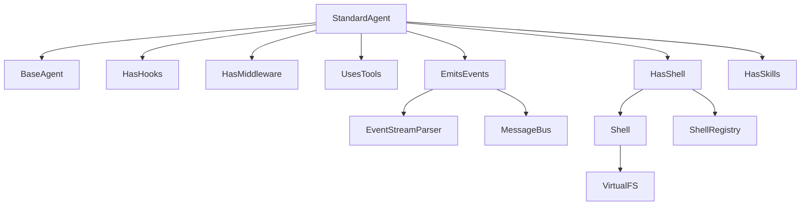

# Agent Harness

A lightweight, composable framework for building LLM-powered agents. Implemented across Python, TypeScript, and PHP with trait/mixin-based composition.

Agent Harness provides a small set of well-defined building blocks that can be mixed and matched to assemble agents with exactly the capabilities you need — nothing more.

## Key Capabilities

- **Trait/mixin composition** — Mix and match agent capabilities (hooks, middleware, tools, events, shell, skills) via language-native composition patterns.
- **Lifecycle hooks** — 22 hook events in Python, 23 in TypeScript/PHP (which add `hook_error`), covering the full agent run cycle plus shell, registration, and skill events: `run_start`, `run_end`, `llm_request`, `llm_response`, `tool_call`, `tool_result`, `tool_error`, `retry`, `token_stream`, `error`, `shell_call`, `shell_result`, `shell_not_found`, `shell_cwd`, `command_register`, `command_unregister`, `tool_register`, `tool_unregister`, `skill_mount`, `skill_unmount`, `skill_setup`, `skill_teardown`.
- **Middleware pipeline** — Sequential pre/post processing of messages with ordered, composable middleware.
- **Tool registration** — Declarative tool definitions with automatic schema generation.
- **Skills** — Mountable capability bundles combining tools, instructions, middleware, hooks, and lifecycle management. Skills subsume slash commands -- any command is just a skill with a single tool.
- **Event emission** — The LLM emits structured YAML events inline in text, which are parsed and routed through a message bus.
- **Streaming events** — Configurable buffered or streaming event delivery.
- **Virtual shell** — In-memory filesystem and shell interpreter giving agents a single `exec` tool for context exploration via standard Unix commands. Supports 30 built-in commands, control flow (`if/elif/else`, `for`, `while`, `case`), logical operators (`&&`, `||`), pipes (`|`) with stderr passthrough, input/output/stderr redirects (`<`, `>`, `>>`, `2>`, `2>>`, `2>&1`, `&>`), variable assignment, command substitution `$(...)`, arithmetic `$((...))`, parameter expansion, and `printf`. Extensible with custom commands via `registerCommand()`. Pure emulation with no real shell or filesystem access.
- **Shell drivers** — Swappable shell backends via `FilesystemDriver` and `ShellDriver` contracts. Built-in driver uses the pure-language shell; optional drivers (e.g., bashkit) can provide POSIX compliance and native performance. Global default with per-agent override via `AgentBuilder.driver()`.

## Architecture Overview

`StandardAgent` composes all available mixins on top of `BaseAgent`. Each mixin is independent and can be applied selectively. `EmitsEvents` relies on an `EventStreamParser` to extract YAML events from LLM output and a `MessageBus` to route them to subscribers. `HasShell` provides an in-memory virtual filesystem and shell interpreter, auto-registering an `exec` tool when `UsesTools` is also composed. `HasSkills` enables mountable capability bundles that combine tools, instructions, middleware, hooks, and lifecycle management.

## Supported Languages

### Python

Async/await throughout. Uses [litellm](https://github.com/BerriAI/litellm) for LLM calls. Capabilities are composed via multiple inheritance mixins.

### TypeScript

Function-based mixins applied to a base class. Uses the OpenAI SDK for LLM calls. Streaming is handled through `createChannel()` primitives.

### PHP

Native PHP traits for composition. Uses Guzzle HTTP for LLM calls. Streaming is implemented with Generator-based iteration.

## Quick Start

Language-specific guides with setup instructions and examples:

- [Python Guide](guides/python.md)
- [TypeScript Guide](guides/typescript.md)
- [PHP Guide](guides/php.md)

## Further Reading

- [Architecture](architecture.md) — detailed component design and data flow
- [Virtual Bash Reference](guides/virtual-bash-reference.md) — supported syntax, commands, and limitations
- [Why Virtual Bash](guides/why-virtual-bash.md) — design rationale for the single-exec-tool approach
- [Principles](principles.md) — design philosophy and constraints
- [Comparison](comparison.md) — cross-language comparison
- [ADRs](adr/) — architecture decision records
